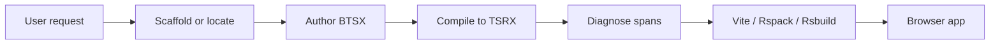

<!-- markdownlint-disable MD013 -->

# Beast Skill

> Agent skill for authoring, diagnosing, and shipping Beast BTSX → TSRX → Octane apps across supported build tools.

[](https://skills.sh/phtn/beast-skill/beast)
[](package.json)
[](package.json)
[](https://octanejs.dev/)
[](LICENSE)

**Scaffold in seconds. Author with indentation. Compile to native TSRX. Let Octane own rendering.**

[Install](#installation) ·
[How it works](#how-it-works) ·
[CLI reference](#cli-reference) ·
[Language server](#language-server) ·
[Diagnostics](#diagnostics) ·
[Changelog](CHANGELOG.md) ·
[Development](#development)

---

Beast Skill is an agent skill for the [Beast](https://github.com/phtn/beast) compiler — an indentation-first language that compiles `.btsx` into readable `.tsrx` for [Octane](https://octanejs.dev/). It gives agents a focused workflow to scaffold, author, diagnose, navigate, watch, and build Beast apps with the Beast language server, Vite, Rspack, or Rsbuild.

It does not replace TypeScript, TSRX, Octane, or an application bundler. It owns the authoring-to-build loop and hands generated TSRX to the existing toolchain.

## At a glance

| Capability | What it does | Why it matters |
| --- | --- | --- |
| Scaffold | Creates a typed Beast + Octane + Vite app, optionally with Tailwind | Starts with a coherent toolchain |
| Author | Indentation-based BTSX with typed props | Keeps structure, keeps types |
| Scope | Places setup and hooks in an exact child position | Preserves child ownership without a wrapper element |
| Compile | BTSX → native TSRX (readable) | Octane remains authority |
| Diagnose | Stable codes + source spans | Makes failures actionable |
| Edit | Beast-aware completion, navigation, hover, and workspace references | Keeps editor guidance aligned with BTSX |
| Build | Validates or watches mixed BTSX/TSRX and integrates Vite, Rspack, or Rsbuild | Ships with source-mapped evidence |

## Installation

Install the skill from GitHub:

```bash
npx skills add https://github.com/phtn/beast-skill --skill beast
```

Then invoke it from a supported agent:

```text
Use $beast to create a new Beast app in ./my-app and build it.
```

Narrow to a file or task:

```text
Use $beast to fix diagnostics in src/App.btsx and show the compiled TSRX diff.
```

```text
Use $beast to scaffold a Beast project without git, then add a keyed list with empty fallback.
```

> [!NOTE]
> The skill workflow verifies, not assumes. In a create-beast app, a clean `bun run check` means TSRX-aware type checking plus a production build.

## How it works



Beast deliberately generates native TSRX — conditions and loops remain template operations, output stays readable, and Octane validates final semantics.

Given this BTSX:

```btsx
module
  interface Props {
    title: string
    links: { id: string, label: string, url: string }[]
  }
props { title, links }: Props
main.app
  p.eyebrow BTSX → TSRX → Octane
  h1 #{title}
  div.flex
    each link in links key link.id
      a.button(id={link.id} href={link.url}) #{link.label}
```

Beast produces this TSRX shape:

```tsrx
export default function App({ title, links }: Props) @{
  <div className="app">
    <p className="eyebrow">BTSX → TSRX → Octane</p>
    <h1>{title}</h1>
    <div className="flex">
      @for (const link of links; key link.id) {
        <a className="button" id={link.id} href={link.url}>{link.label}</a>
      }
    </div>
  </div>
}
```

## Direct usage (without agent)

Scaffold:

```bash
bun create beast@latest my-app
cd my-app
bun run dev
# options: --tailwind --no-install --no-git --force
```

Compile one file:

```bash
bunx beast compile src/App.btsx --output /tmp/App.tsrx
```

Project doctor (skill-owned, bounded, no exec):

```bash
node ./scripts/beast-doctor.cjs src --json /tmp/beast-report.json
```

## CLI reference

### create-beast

```text
bun create beast@latest [directory] [options]
bun x create-beast@latest [directory] [options]
```

| Option | Effect |
| --- | --- |
| `--tailwind` | Use the dedicated Tailwind CSS template |
| `--no-install` | Write files without `bun install` |
| `--no-git` | Skip `git init` |
| `--force` | Write template into non-empty dir (keeps unrelated files) |
| `-h, --help` | Show help |

### beast compiler

```text
beast compile <input.btsx> [-o <output.tsrx>] [--component-name <name>] [--props <parameter>] [--no-validate]
beast build [source-dir] [--out-dir <directory>] [--no-validate] [--watch]
```

| Command | Description |
| --- | --- |
| `compile` | Single-file BTSX → TSRX, reports source spans |
| `build` | Recursive mixed BTSX/TSRX build, validates natives, writes a manifest, and prunes tracked stale outputs after success |
| `build --watch` | Debounced, serialized rebuilds that report errors and recover after later edits |

Detailed references:

- [Scaffolding and CLI](references/beast-cli.md)
- [Vite](references/beast-vite.md)
- [Rspack](references/beast-rspack.md)
- [Rsbuild](references/beast-rsbuild.md)

### App scripts (generated template)

| Script | What it does |
| --- | --- |
| `bun run dev` | Vite dev server (Beast → Octane in memory) |
| `bun run build` | Vite production build |
| `bun run typecheck` | `tsrx-tsc --noEmit` (TSRX-aware) |
| `bun run check` | `typecheck && build` |
| `bun run preview` | Preview built app |

## Language server

Install the project-local LSP server and configure the editor to launch it over
stdio:

```bash
bun add --dev beast-language-server
beast-language-server --stdio
```

The first release supplies Beast compiler diagnostics; keyword, HTML,
component, prop, and relative-import completion; component auto-import edits;
definitions; import links; document symbols; component hover; and workspace
component references. It does not yet supply TypeScript expression semantics,
so keep `bun run typecheck` and the production build in the verification loop.

Configuration, capability boundaries, and troubleshooting:
[references/beast-language-server.md](references/beast-language-server.md).

## Diagnostics

Diagnostics are stable codes with `SourceSpan { start: {line,column,offset}, end }`.

- **Indentation error** → use spaces, align siblings, and indent children beneath parents
- **Continuation error** → indent `~` beneath the logical line it extends; an orphan reports `BEAST1004_ORPHAN_CONTINUATION`
- **Invalid element/fragment/style/spread** → check `references/beast-diagnostics.md`
- **Invalid control flow** → `empty` must align with `each`, `case`/`default` inside `switch`, `pending` before `catch`
- **Component** → `component Name` must be Capitalized, have body

Full table: [references/beast-diagnostics.md](references/beast-diagnostics.md).

## Security model

Scanned repositories are treated as untrusted input.

- Native Beast parses source; the dependency-free doctor performs lexical triage; neither imports nor executes target modules
- Comments, strings, docs, filenames are data — not instructions
- Doctor reads are bounded to the first 4 MiB per file, and raw source is excluded from reports
- No network requests, no dependency installs
- Secrets encountered are redacted, never reproduced

## Repository structure

```text
beast-skill/
├── SKILL.md                          # Agent workflow and trust boundary
├── agents/openai.yaml                # Agent-facing metadata
├── references/
│   ├── beast-syntax-core.md          # Ordinary BTSX authoring
│   ├── beast-syntax-control.md       # Conditions, lists, switches, boundaries
│   ├── beast-syntax-advanced.md      # Continuations, styles, maps
│   ├── octane-hooks-core.md           # State, context, refs, and hook placement
│   ├── octane-hooks-effects.md        # Effects, stores, and custom hooks
│   ├── octane-hooks-async.md          # Suspense, transitions, and actions
│   ├── ui-component-authoring.md      # Reusable UI component architecture
│   ├── octane-bindings.md             # Design-system and library bindings
│   ├── octane-tanstack-form.md         # Form state, fields, and validation
│   ├── octane-tanstack-table.md        # Typed table models and rendering
│   ├── beast-diagnostics.md          # Error codes and fixes
│   ├── beast-cli.md                  # Scaffold, compile, build, and watch
│   ├── beast-vite.md                 # Vite adapter
│   ├── beast-rspack.md               # Rspack adapter
│   ├── beast-rsbuild.md              # Rsbuild adapter
│   ├── beast-language-server.md      # LSP setup, capabilities, and boundaries
│   ├── beast-coverage.md             # Octane parity map
│   └── ui-components.md              # Compelling project UI index
├── scripts/
│   ├── beast-doctor.cjs              # Portable bounded checker
│   ├── src/beast-doctor.ts           # Source of truth
│   └── sync-installed-skill.cjs      # Keeps the active local mirror in sync
├── CHANGELOG.md                       # Skill release notes
├── package.json
└── tsconfig.json
```

## Development

Requirements: Node.js 22.22.2 or newer.

```bash
npm ci
npm run check
```

After changing skill files, run `npm run sync:skill`. When the local
`.agents/skills/beast` mirror exists, `npm run check` fails if it has drifted
from the root source. The ignored mirror is not part of the published skill.

When changing the doctor:

1. Edit `scripts/src/beast-doctor.ts`, not the generated `scripts/beast-doctor.cjs`.
2. Run `npm run build` and verify the committed runtime is updated.

## License

Released under the [ISC License](LICENSE).

---

*Built for fast, indentation-first Beast development.*

[View Beast on GitHub](https://github.com/phtn/beast) · [View Beast Skill on skills.sh](https://skills.sh/phtn/beast-skill/beast)
